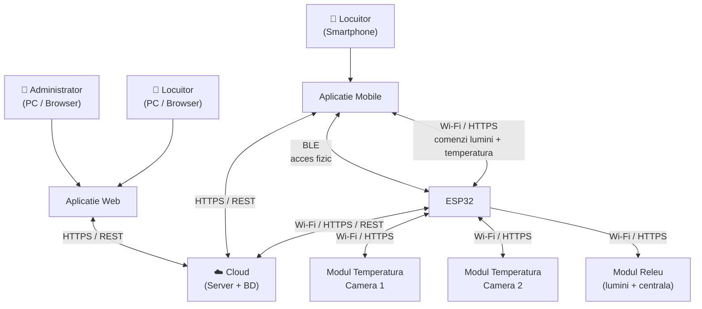
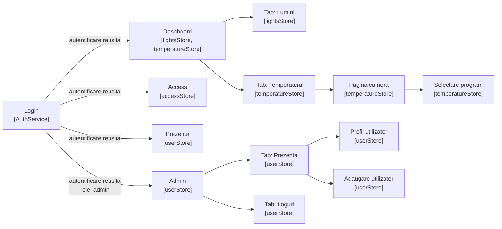
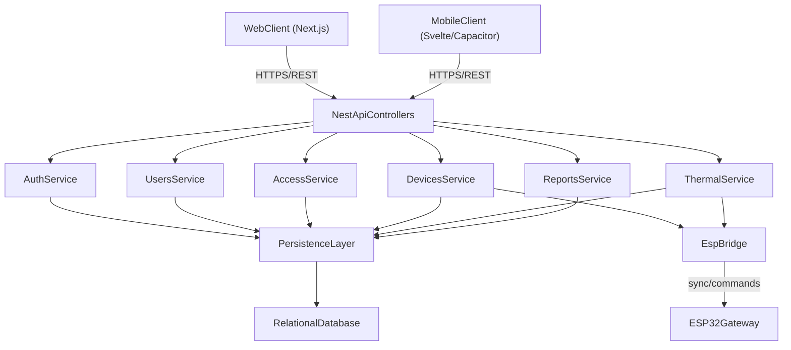
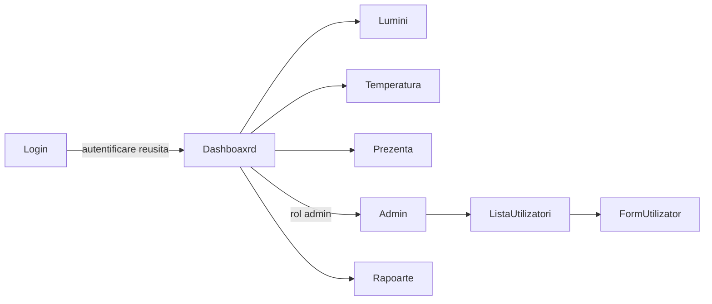

# 1. Schema arhitecturală generală

Sistemul BlueLock este compus din șase componente care colaborează pentru a asigura funcționarea integrată a sistemului:

- **Serverul cloud** reprezintă nucleul sistemului, responsabil de stocarea datelor, gestionarea utilizatorilor și expunerea unui API REST prin care celelalte componente software comunică.
- **Aplicația mobilă** este interfața principală prin care locuitorii interacționează cu sistemul: controlul accesului fizic, al luminilor și al temperaturii.
- **Website-ul** oferă aceleași funcționalități ca aplicația mobilă, accesibil prin browser de pe PC sau smartphone, utilizat în special de administrator.
- **Modulul ESP32** este componenta centrală a hardware-ului, responsabilă de controlul fizic al zăvorului electromagnetic, al releelor de iluminat și al electrovalvelor de încălzire, pe baza comenzilor primite și a buclelor de reglare a temperaturii.
- **Modulele de temperatură** citesc temperatura din fiecare cameră și o transmit periodic către ESP32 prin Wi-Fi.
- **Modulul releu** execută comenzile fizice pentru lumini și centrala termică, primite de la ESP32.



Comunicația dintre componente este ilustrată în diagrama de mai sus, cu protocoalele aferente fiecărui canal.

# 2. Modelul arhitectural

Sistemul BlueLock este construit pe o arhitectură client-server pe trei niveluri (three-tier), în care clienții (aplicația mobilă și website-ul) comunică cu serverul cloud prin HTTPS. Modulul ESP32 reprezintă o excepție parțială: deși comunică cu serverul cloud pentru sincronizarea datelor, acceptă și comenzi directe de la aplicația mobilă prin Wi-Fi local și BLE, fără a trece prin server.

**Modulul Server** este proiectat pe model three-tier, cu separare clară între stratul API (controllere REST), stratul de logică de business (servicii de domeniu) și stratul de persistență (acces la baza de date). Stratul API expune endpoint-uri pentru web și mobile, stratul de business implementează regulile de autentificare, autorizare pe roluri, administrare utilizatori, control dispozitive și raportare, iar stratul de persistență gestionează entitățile, relațiile și integritatea tranzacțională. Modelul de securitate include sesiune unică per cont, tokenuri de acces cu expirare, guard-uri de autorizare pe roluri și jurnalizarea operațiilor administrative.

**Modulul Website** folosește arhitectură component-based, cu separare între componente de prezentare, managementul stării și serviciile de integrare API. Alegerea Next.js + React + TypeScript este justificată prin ecosistem matur, routing modern, performanță bună la randare și reutilizare facilă a componentelor. Interfața web se integrează cu serverul exclusiv prin endpoint-uri HTTPS/REST, trimițând tokenul de sesiune în cereri și actualizând starea UI pe baza răspunsurilor API.

**Aplicația mobilă** urmează o arhitectură pe trei straturi: View, Stores și Services. Comunicația cu sistemele externe se realizează prin trei canale distincte:

- **HTTPS către server** pentru funcționalitățile cloud-dependente: autentificare, administrare utilizatori, rapoarte și prezență
- **Wi-Fi direct către ESP32** pentru comenzile de lumini și temperatură când dispozitivul se află pe aceeași rețea locală cu ESP32, fără a trece prin server
- **BLE direct către ESP32** exclusiv pentru accesul fizic prin ușă, independent de conexiunea la internet și de rețeaua locală

**\*Modulul Embedded (de completat de echipa embedded)** De descris: modelul arhitectural ales pentru ESP32 (event-driven, loop-based etc.), cum sunt organizate modulele software intern (modul BLE, modul Wi-Fi, bucla de reglare temperatură, comanda lumini), justificarea abordării alese pentru gestionarea simultană a mai multor funcționalități pe un dispozitiv cu resurse limitate.\*

Fluxul general de date urmează un model unidirecțional și asincron cu două variante în funcție de disponibilitatea rețelei locale. Când dispozitivul mobil se află pe aceeași rețea cu ESP32, comenzile de control sunt trimise direct, iar serverul este notificat asincron pentru înregistrarea evenimentelor. Când dispozitivul este în afara rețelei locale, toate comenzile trec prin server. Accesul fizic prin BLE rămâne întotdeauna direct, indiferent de topologia rețelei.

# 3. Tehnologii folosite

**Modulul Server** folosește: Node.js + TypeScript, framework NestJS, bază de date relațională PostgreSQL (modelată prin schema proiectului), rulare containerizată cu Docker și instrumente standard de dezvoltare/testare API (ex. Postman/Insomnia). Pentru securitate și validare sunt utilizate mecanisme de autentificare pe token, autorizare pe roluri și validări server-side ale payload-urilor.

**Modulul Website** folosește: Next.js (App Router), React, TypeScript și Tailwind CSS pentru interfață. Pentru integrarea cu backend-ul se utilizează apeluri HTTP către API-ul serverului, iar pentru calitatea codului se folosesc reguli de linting și verificare statică de tipuri.

**Modulul Mobile** foloseste:

- Svelte + TypeScript
- Capacitor
- Capacitor BLE Plugin
- Capacitor Preferences Plugin
- Fetch API
- Visual Studio Code + Android Studio

**\*Modulul Embedded (de completat de echipa embedded)** De completat: mediu de dezvoltare, librării BLE și Wi-Fi, protocol de comunicație cu modulele de temperatură.\*

# 4. Proiectarea modulului mobile

## 4.1. Arhitectura internă a aplicației

Aplicația mobilă BlueLock este dezvoltată ca o aplicație web progresivă împachetată nativ prin Capacitor, utilizând Svelte cu TypeScript pentru interfața utilizator. Capacitor asigură accesul la funcționalitățile native ale dispozitivului Android, în special Bluetooth Low Energy și stocarea locală securizată, expunându-le aplicației web printr-un strat de abstractizare unificat.

Alegerea Capacitor ca wrapper nativ în locul unei implementări Android native este justificată de faptul ca echipa are experiență în dezvoltare web și Capacitor oferă acces la toate funcționalitățile native necesare (BLE și stocare securizată) prin plugin-uri mature și bine documentate.

Arhitectura internă a aplicației este organizată în trei straturi cu responsabilități clare și bine delimitate, dupa pattern-ul MVVM:

- **Stratul de interfață utilizator (View):** este compus din componente Svelte care se ocupă exclusiv de prezentarea datelor și capturarea interacțiunilor utilizatorului. Componentele nu conțin logică de business și nu accesează direct surse de date. Ele subscriu la store-uri și reacționează automat la modificările acestora.
- **Stratul de stare (Stores, ViewModel):** este implementat prin Svelte stores și reprezintă sursa unică de adevăr pentru starea aplicației. Store-urile expun date în format gata de consum pentru componente și orchestrează apelurile către stratul de servicii. Fiecare domeniu funcțional al aplicației are un store dedicat.
- **Stratul de servicii (Services, Model):** conține logica de acces la date și la funcționalitățile native. Serviciile se ocupă de comunicația cu serverul prin HTTPS, comunicația BLE cu ESP32 prin Capacitor și stocarea locală a datelor. Nu știu nimic despre starea aplicației sau despre interfața utilizator.

Fluxul de date este unidirecțional:

```mermeid
flowchart TD
    A[Componenta Svelte]
    B[Acțiune utilizator]
    C[Store]
    D[Service]
    E[Date returnate]
    F[Actualizare automată]
    G[Componenta Svelte]

    A --> B
    B --> C
    C --> D
    D --> E
    E --> C
    C --> F
    F --> G
```

Componentele principale ale fiecărui strat:

- _Servicii:_
  - **AuthService** = autentificare, gestiunea tokenului de sesiune, invalidarea sesiunii
  - **BluetoothService** = inițierea conexiunii BLE cu ESP32, trimiterea codului de acces, recepția confirmărilor
  - **UserService** = operațiuni CRUD pentru conturi de utilizator, disponibil doar pentru administrator
  - **AccessService** = înregistrarea evenimentelor de acces local și sincronizarea cu serverul
  - **LightsService** = trimiterea comenzilor de iluminat către server
  - **TemperatureService** = preluarea și trimiterea programelor de temperatură către server
- _Store-uri:_
  - **authStore** = starea sesiunii curente, tokenul activ, rolul utilizatorului
  - **accessStore** = starea ușii, statusul contului, istoricul recent al evenimentelor
  - **lightsStore** = starea curentă a fiecărui circuit de iluminat
  - **temperatureStore** = programele disponibile, programul activ per cameră, temperaturile curente
  - **userStore** = lista utilizatorilor și statusurile acestora, disponibil doar pentru administrator

## 4.2. Schema componentelor aplicației

```
src/
├── routes/                          # Ecrane (View)
│   ├── login/
│   │   └── +page.svelte
│   ├── dashboard/
│   │   ├── +page.svelte             # Container cu tab-uri
│   │   ├── lights/
│   │   │   └── LightsTab.svelte
│   │   └── temperature/
│   │       ├── TemperatureTab.svelte
│   │       └── [roomId]/
│   │           └── +page.svelte     # Pagina camerei
│   ├── access/
│   │   └── +page.svelte
│   ├── presence/
│   │   └── +page.svelte
│   └── admin/
│       ├── +page.svelte             # Container cu tab-uri
│       ├── presence/
│       │   ├── PresenceTab.svelte
│       │   ├── [userId]/
│       │   │   └── +page.svelte     # Profil utilizator
│       │   └── add/
│       │       └── +page.svelte     # Adaugare utilizator
│       └── logs/
│           └── LogsTab.svelte
│
├── lib/
│   ├── components/                  # Componente reutilizabile
│   │   ├── ProgramCard.svelte
│   │   ├── RoomCard.svelte
│   │   ├── PresenceCard.svelte
│   │   ├── LightCard.svelte
│   │   └── DayIndicator.svelte
│   │
│   ├── stores/                      # Stratul de stare
│   │   ├── authStore.ts
│   │   ├── accessStore.ts
│   │   ├── lightsStore.ts
│   │   ├── temperatureStore.ts
│   │   └── userStore.ts
│   │
│   └── services/                    # Stratul de servicii
│       ├── AuthService.ts
│       ├── BluetoothService.ts
│       ├── UserService.ts
│       ├── AccessService.ts
│       ├── LightsService.ts
│       └── TemperatureService.ts
```

Stratul de componente reutilizabile va fi rafinat pe parcursul implementării pe măsură ce pattern-urile de reutilizare devin evidente. La faza de proiectare au fost identificate componentele derivate din design: carduri de cameră, carduri de program cu indicatori de zile și timeline de temperatură, carduri de prezență și formulare de administrare utilizatori etc.

## 4.3. Arborescența dialogurilor



## 4.4. Tehnologii și medii de dezvoltare

Tehnologiile și mediu de dezvoltare folosite sunt:

- **Svelte + TypeScript** = framework UI reactiv cu tipizare statică
- **Capacitor** = wrapper nativ pentru Android, versiunea minimă Android 8.0 (API level 26)
- **Capacitor BLE Plugin** = acces la Bluetooth Low Energy pentru comunicația cu ESP32
- **Capacitor Preferences Plugin** = stocare locală securizată pentru tokenul de sesiune și codul BLE
- **Fetch API** = comunicația HTTPS cu serverul, cu interceptori pentru atașarea automată a tokenului de sesiune
- **Android Studio** = mediu de dezvoltare pentru build și deployment pe dispozitive Android
- **Visual Studio Code** = mediu de dezvoltare pentru interfata si functionalitate, cu testare in browser sau live deploy pe dispozitive Android

## 4.5. Sistemul de operare

Aplicația este compatibilă exclusiv cu dispozitive Android, versiunea minimă 8.0 (API level 26), necesară pentru suportul complet al Bluetooth Low Energy utilizat în comunicația cu ESP32.

# 5. Proiectarea modulului server

## 5.1. Arhitectura internă

Modulul server urmează o arhitectură **three-tier**, implementată modular în NestJS, cu separare clară pe trei niveluri:

- **Presentation layer (API):** controller-ele expun endpoint-uri REST pentru mobile și web.
- **Business layer (Application/Domain):** serviciile aplică regulile de business (autentificare, sesiune unică, administrare utilizatori, control dispozitive, raportare).
- **Data layer (Persistence):** repository-urile gestionează accesul la baza de date și maparea entităților persistente.

Organizarea logică este pe module funcționale, fiecare cu responsabilitate unică:

- **AuthModule:** login, refresh, invalidare sesiuni, politici de autentificare.
- **UsersModule:** CRUD utilizatori, suspendare/reactivare/ștergere, roluri.
- **AccessModule:** evenimente acces, prezență curentă, istoric.
- **DevicesModule:** stări dispozitive, comenzi lumini, sincronizare cu ESP32.
- **ThermalModule:** programe temperatură, setpoint/histerezis/offset, override manual.
- **ReportsModule:** agregări și rapoarte pentru interfețele client.

Acest model permite delimitarea clară a muncii în echipă și reduce dependențele dintre componente, în conformitate cu obiectivul secțiunii de Proiectare.

## 5.2. Schema componentelor



Diagrama evidențiază delimitarea pe componente, canalele de intrare/ieșire și punctele de integrare externe.

## 5.3. Tehnologii și mediu de dezvoltare

Tehnologiile și mediul de dezvoltare pentru server sunt:

- **Node.js + TypeScript** = runtime și limbaj principal pentru implementarea serviciilor backend.
- **NestJS** = framework backend modular, bazat pe dependency injection, potrivit pentru arhitectură enterprise.
- **PostgreSQL (țintă de proiectare)** = bază de date relațională pentru persistența utilizatorilor, evenimentelor și configurațiilor de sistem.
- **Prisma/ORM echivalent (strat de persistență)** = mapare entități și control al migrărilor.
- **JWT + Guards NestJS** = autentificare/autorizare cu control pe roluri.
- **Docker** = containerizare pentru medii consistente dezvoltare/test/deploy.
- **Visual Studio Code** = IDE principal pentru dezvoltare backend.
- **Postman/Insomnia** = testarea endpoint-urilor API în faza de integrare.

## 5.4. Modelul bazei de date

Modelul de date este relațional și urmărește separarea pe domenii funcționale:

- **Identity & Access:** `users`, `roles`, `auth_sessions`, `access_events`
- **Home topology:** `homes`, `rooms`, `devices`, `room_devices`
- **Lighting:** `light_zones`, `light_commands`, `light_events`
- **Thermal:** `heating_loops`, `temperature_readings`, `temperature_programs`, `heating_demands`, `valve_events`, `boiler_events`
- **Audit & monitoring:** `device_status_log`

Reguli de proiectare fizică (conform cerinței din TemaTehnica):

- Chei primare numerice pe fiecare entitate.
- Chei externe pentru relații între utilizatori, locuințe, camere și dispozitive.
- Constrângeri de unicitate pentru identificatori critici (ex: telefon, CNP, seriale dispozitive).
- Constrângeri de validare pentru valori controlate (statusuri, tipuri dispozitive, tipuri evenimente).
- Indexare pentru căutări frecvente în istoric și rapoarte (timestamp, user_id, device_id, zone/loop-uri).

Modelul fizic detaliat este reflectat în scriptul de bază din `COD/DATABASES/schema.sql`.

## 5.5. Descrierea API-ului

API-ul urmează convenția REST și returnează date în format JSON.

Endpoint-uri principale:

- **Auth**
  - `POST /auth/login`
  - `POST /auth/refresh`
  - `POST /auth/logout`
- **Users**
  - `GET /users`
  - `POST /users`
  - `PATCH /users/:id`
  - `POST /users/:id/suspend`
  - `POST /users/:id/reactivate`
  - `DELETE /users/:id`
- **Access & Presence**
  - `GET /access/events`
  - `POST /access/events/sync`
  - `GET /presence`
- **Lighting**
  - `GET /lights/zones`
  - `POST /lights/zones/:id/command`
- **Thermal**
  - `GET /thermal/loops`
  - `GET /thermal/programs`
  - `POST /thermal/loops/:id/program`
- **Reports**
  - `GET /reports/access`
  - `GET /reports/temperature`

Structură standard request/response:

- **Request:** payload JSON validat server-side, cu token de autorizare în antet.
- **Response succes:** obiect JSON cu date și metadate minime (timestamp, status).
- **Response eroare:** cod HTTP + mesaj explicit + cod intern de eroare pentru diagnostic.

## 5.6. Securitate

Măsurile de securitate implementate la nivel server:

- **Transport securizat:** toate comunicațiile API se fac prin HTTPS.
- **Autentificare:** token de sesiune (JWT) emis la login și invalidat la sesiuni concurente.
- **Autorizare pe roluri:** control RBAC pentru endpoint-uri administrative.
- **Parole:** stocare doar sub formă hash-uită (fără persistare în clar).
- **Sesiune unică:** autentificarea pe un dispozitiv invalidează sesiunea anterioară.
- **Audit:** jurnalizare acțiuni administrative și evenimente de securitate.
- **Validare input:** validare strictă pentru payload-uri și filtrare a valorilor neconforme.

# 6. Proiectarea modulului web

## 6.1. Arhitectura internă

Modulul web este implementat pe arhitectură **component-based**, utilizând Next.js și TypeScript.

Structura internă urmărește separarea responsabilităților:

- **UI Layer:** pagini și componente de prezentare (dashboard, administrare, rapoarte).
- **State Layer:** management de stare pentru sesiune, date operaționale și filtre de raportare.
- **Data Layer:** servicii pentru apeluri API către server și mapare răspunsuri către modelul UI.

Această arhitectură permite reutilizarea componentelor, testabilitate ridicată și extensie graduală a funcționalităților web.

## 6.2. Schema componentelor

Componentele principale ale aplicației web:

- **Pagini principale:**
  - Login
  - Dashboard (status sistem)
  - Lumini
  - Temperatură
  - Prezență
  - Admin utilizatori
  - Rapoarte
  - Acces

- **Componente reutilizabile:**
  - StatusCard
  - LightToggleCard
  - TemperatureProgramCard
  - PresenceList
  - UsersTable
  - ReportFilters

Fluxul de navigare este centrat pe dashboard, cu acces contextual către operațiile administrative și de raportare în funcție de rol.

## 6.3. Tehnologii și mediu de dezvoltare

Tehnologiile și mediul de dezvoltare pentru modulul web:

- **Next.js (App Router)** = framework web pentru routing, rendering și optimizări de performanță.
- **React + TypeScript** = UI reactiv cu tipizare statică.
- **TanStack Query** = pentru server state.
- **Zustand** = pentru client/global UI State.
- **React Hook Form + ZOD** = validare formulare.
- **Tailwind CSS** = stilizare rapidă și consistentă între componente.
- **Fetch/HTTP client** = integrare cu API-ul serverului.
- **ESLint + TypeScript checks** = control al calității codului.
- **Visual Studio Code** = IDE principal.
- **Browser DevTools** = analiză runtime și depanare UI/network.

## 6.4. Arborescența dialogurilor



Navigarea este condiționată de rol: secțiunea de administrare este disponibilă doar utilizatorilor cu privilegii administrative.

## 6.5. Responsive design

Strategia responsive pentru interfața web:

- **Desktop-first cu adaptare progresivă:** layout pe grilă pentru ecrane mari, reorganizat pe coloană pentru ecrane mici.
- **Breakpoints standardizate:** praguri dedicate pentru mobile, tabletă și desktop.
- **Componente adaptive:** tabelele administrative trec în carduri compacte pe mobile.
- **Navigare adaptivă:** meniu lateral pe desktop, meniu condensat pe mobile.
- **Prioritizare informațională:** pe ecrane mici se afișează întâi acțiunile critice (stare ușă, acces, comenzi esențiale).

Scopul este menținerea funcționalității complete pe toate dimensiunile de ecran, fără diferențe de capabilitate între platforme.

# 7. Proiectarea modulului embedded

## 7.1. Arhitectura internă

_schema modulelor software din ESP32 (modul BT, modul Wi-Fi, bucla de reglare temperatură, comanda lumini)_

## 7.2. Schema hardware

_diagrama conexiunilor fizice dintre ESP32, relee, senzori și module de temperatură_

## 7.3. Tehnologii și mediu de dezvoltare

_Arduino IDE, librării BLE și Wi-Fi folosite_

## 7.4. Descrierea buclei de reglare

_algoritmul de control biopozițional cu histerezis_

## 7.5. Protocolul de comunicație BLE

_structura mesajelor schimbate cu aplicația mobilă_

## 7.6. Sincronizarea cu serverul

_mecanismul de actualizare a tabelei de coduri și a programelor de temperatură_

## 7.8. Diagrame de stare

_stările ESP32 (idle, procesare acces, comanda lumini, reglare temperatură)_
